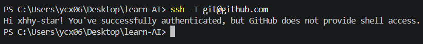

# Crazy Day — Task0 学习记录
## 个人信息
姓名：姚承希
GitHub用户名：xhhy-star

## 今日任务目标
完成GitHub账号准备，配置SSH密钥，Fork西二AI组仓库，使用Git克隆仓库到本地，完成文件提交，熟悉Git基础工作流。

## 遇到的问题与踩坑记录
1. VS Code图形界面Clone仓库时报错 `Cannot set properties of undefined (setting 'items')`，无法直接克隆，改用终端git clone命令解决。
2. 一开始分不清HTTPS链接和SSH链接。HTTPS每次提交需要token，SSH配置密钥之后免密推送，所以选择SSH方式。
3. 一开始混淆仓库地址：不能直接克隆西二原始仓库，需要先Fork到自己GitHub账号下，否则没有推送权限。
4. GitHub访问不稳定，校园网推送容易超时，备选方案：切换手机热点进行git push。
5. AirPods Max设备偶发睡死问题：明明耳机有电，长按按键无法正常连接，需要短暂充电才能唤醒；排查后了解是设备休眠机制问题，后续学习了重置耳机的操作方法喵。

## 学到的知识点
1. Fork：将别人的仓库复制一份到自己GitHub账号下，得到一份可修改的副本。
2. SSH密钥：本地电脑和GitHub之间免密身份验证，不用每次提交输入账号密码。
3. Git基础流程：
    - git clone：把远程仓库下载到本地电脑
    - git add：把文件加入暂存区
    - git commit：在本地生成一次版本记录
    - git push：将本地的版本上传到GitHub远程仓库
4. 仓库工作原则：本地编辑文件，通过Git提交，禁止直接在网页端修改作业。
5. 电子设备故障排查思路：遇到硬件异常先查阅官方文档，区分是软件休眠卡死还是硬件故障。

## 总结
今天熟悉了Git与GitHub的基础操作，踩了不少环境配置的坑。中途也遇到AirPods Max连接异常的小麻烦，学会了简单的设备问题排查。明白了版本控制的作用，后续会继续学习Python，完成西二后续Task任务。

