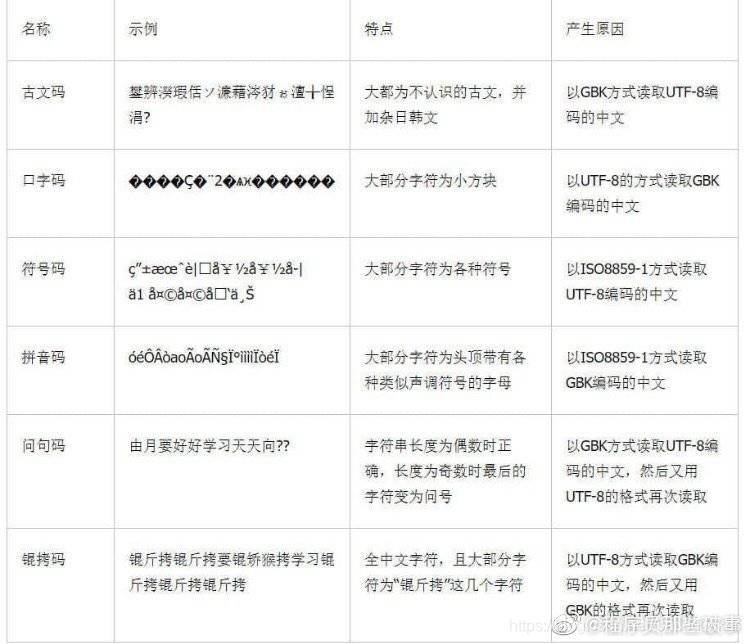
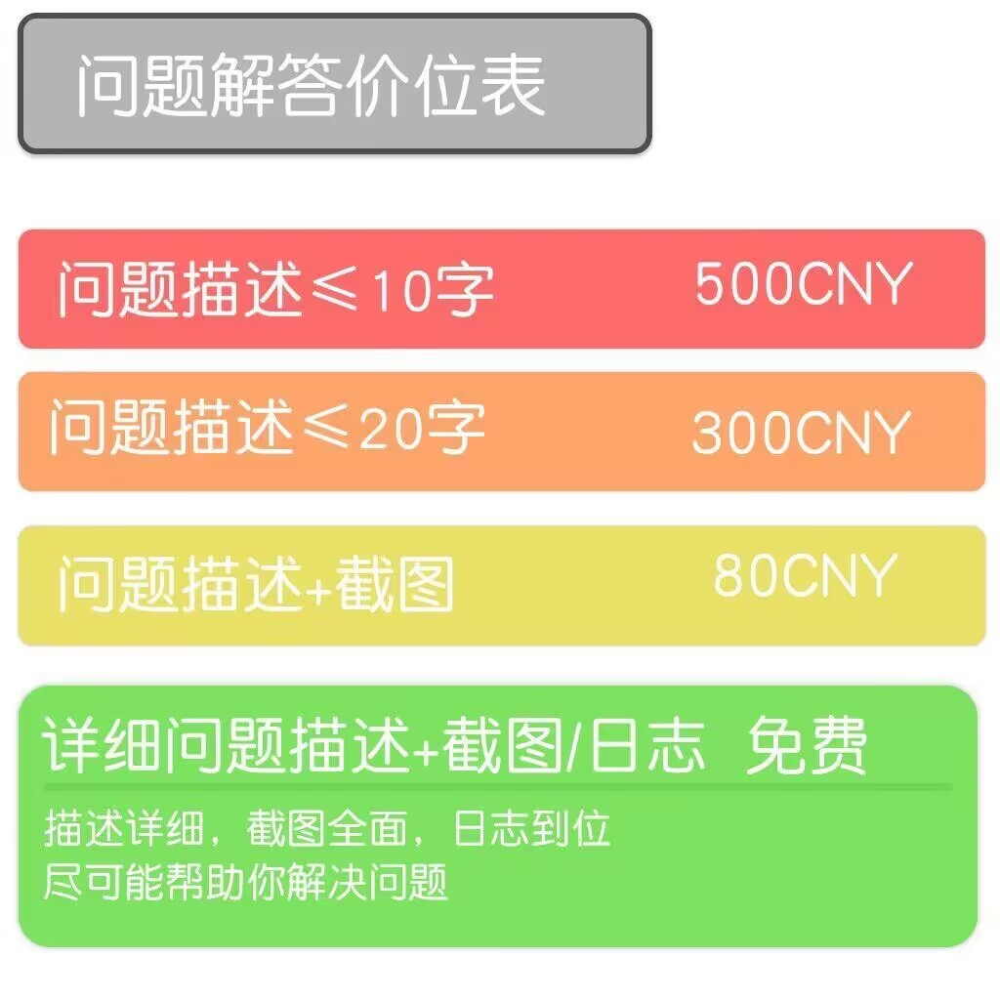

# Task 0 计算机基础知识

本文档汇总了进行 AI 学习所需掌握的计算机基础知识。你不需要一开始就全部掌握，而是在遇到相关问题时，再回来查阅对应的章节。

## 📋 知识清单

### 基础准备
- [ ] 注册 Google 账号和 GitHub 账号
- [ ] 配置科学上网工具
- [ ] 学习 Markdown 基础语法

### 版本控制
- [ ] 掌握 Git 基本操作（clone、commit、push）
- [ ] 学会使用 GitHub（创建仓库、提交 PR）
- [ ] 理解 Git 工作流
- [ ] 配置 `.gitignore` 文件避免上传缓存文件

### 开发环境
- [ ] 配置 Python 虚拟环境（Conda 或 venv）
- [ ] 安装并配置 IDE（PyCharm 或 VS Code）
- [ ] 掌握终端/命令行基本操作

### Python 编码规范
- [ ] 了解 PEP 8 命名规范
- [ ] 掌握 `if __name__ == "__main__"` 的使用
- [ ] 学会使用代码风格检查工具（pylint、flake8）

### 网络基础
- [ ] 理解 HTTP 协议和状态码
- [ ] 学会使用 Python requests 库调用 API
- [ ] 了解 API 认证方式

### 系统操作
- [ ] 掌握文件和目录管理
- [ ] 学会使用终端运行程序
- [ ] 了解不同操作系统的差异（Windows/macOS/Linux）

### 错误处理
- [ ] 识别三种错误类型（语法、运行时、逻辑）
- [ ] 学会阅读错误信息和堆栈跟踪
- [ ] 掌握基本调试方法（print 调试、断点调试）
- [ ] 理解解释型语言的特点

### 编码与字符集
- [ ] 统一使用 UTF-8 编码
- [ ] 了解常见编码错误的解决方法

---

## 前置准备

### 账号与工具准备

在开始学习之前，你需要完成以下准备工作：

1. 注册 Google 账号，并配置科学上网工具
2. 注册 [GitHub](https://github.com/) 账号
3. 注册一个非 QQ 的邮箱（推荐网易邮箱或 Gmail）用于接收学术通知

> 如果在科学上网方面遇到困难，可以私聊寻求帮助。

## 文档编写

### Markdown 语法

Markdown 是一种轻量级标记语言，广泛应用于技术文档编写。你将使用 Markdown 格式完成作业文档和项目说明。

* 学习资源：[Markdown 基础语法](https://markdown.com.cn/basic-syntax/)

### 编程规范

良好的编程习惯从命名开始。掌握规范的变量命名方式，将让你的代码更易读、更易维护。

* 常用命名规范：
  * 驼峰命名法（camelCase）：适用于变量和函数名
  * 帕斯卡命名法（PascalCase）：适用于类名
  * 下划线命名法（snake_case）：Python 推荐使用

### Python 编码规范

虽然 Python 以灵活著称，但遵循一些基本规范能让代码更专业、更易维护。

#### PEP 8 核心规范

PEP 8 是 Python 官方的代码风格指南。以下是最重要的规范：

**命名规范**

* 变量和函数：使用小写字母，单词之间用下划线分隔（snake_case）
  ```python
  user_name = "Alice"
  def calculate_total_price():
      pass
  ```

* 类名：使用大驼峰命名法（PascalCase）
  ```python
  class StudentManager:
      pass
  ```

* 常量：使用全大写字母，单词之间用下划线分隔
  ```python
  MAX_SIZE = 100
  DEFAULT_TIMEOUT = 30
  ```

* 私有变量/方法：以单下划线开头
  ```python
  class MyClass:
      def __init__(self):
          self._private_var = 10
      
      def _private_method(self):
          pass
  ```

**缩进与空格**

* 使用 4 个空格进行缩进（不要使用 Tab）
* 运算符两边各留一个空格
  ```python
  # 正确
  result = a + b
  
  # 错误
  result=a+b
  ```

* 逗号后面加空格
  ```python
  # 正确
  my_list = [1, 2, 3, 4]
  
  # 错误
  my_list = [1,2,3,4]
  ```

* 函数定义和类定义前后空两行
  ```python
  def function1():
      pass
  
  
  def function2():
      pass
  ```

**行长度限制**

* 每行代码不超过 79 个字符（文档字符串和注释不超过 72 个字符）
* 过长的代码可以使用括号、反斜杠或三引号换行
  ```python
  # 使用括号换行
  long_string = (
      "这是一个很长的字符串，"
      "需要分成多行来写"
  )
  
  # 列表换行
  my_list = [
      'item1', 'item2', 'item3',
      'item4', 'item5', 'item6'
  ]
  ```

#### `if __name__ == "__main__"` 的使用

这是 Python 中最重要的编码习惯之一。

**作用说明**

* 区分模块的两种使用方式：
  1. **直接运行**：`python script.py`
  2. **被导入**：`import script`

* 只有在直接运行时，`if __name__ == "__main__"` 代码块才会执行

**基本用法**

```python
def greet(name):
    """打招呼函数"""
    return f"Hello, {name}!"


def main():
    """主函数"""
    print(greet("Alice"))
    print(greet("Bob"))


if __name__ == "__main__":
    main()
```

**为什么要使用？**

* **模块复用**：其他文件可以导入你的函数，而不会自动执行测试代码
  ```python
  # 文件：utils.py
  def add(a, b):
      return a + b
  
  if __name__ == "__main__":
      # 这些测试代码只在直接运行 utils.py 时执行
      print(add(1, 2))
      print(add(5, 10))
  
  # 文件：main.py
  from utils import add  # 导入时不会执行测试代码
  result = add(100, 200)
  ```

* **代码测试**：可以在模块底部写测试代码，不影响模块的导入使用

* **脚本入口**：明确标识程序的入口点

**标准项目结构示例**

```python
#!/usr/bin/env python3
# -*- coding: utf-8 -*-
"""
模块的文档字符串
简要描述模块的功能
"""

import os
import sys


# 常量定义
MAX_RETRY = 3
DEFAULT_TIMEOUT = 30


# 类定义
class MyClass:
    """类的文档字符串"""
    def __init__(self):
        pass


# 函数定义
def helper_function():
    """辅助函数"""
    pass


def main():
    """主函数，包含程序的主要逻辑"""
    print("程序开始运行")
    # 主要逻辑代码
    pass


if __name__ == "__main__":
    main()
```

#### 其他重要规范

**导入顺序**

导入语句应该分组，每组之间空一行：

1. 标准库
2. 第三方库
3. 本地模块

```python
# 标准库
import os
import sys
from datetime import datetime

# 第三方库
import numpy as np
import pandas as pd
import requests

# 本地模块
from my_module import my_function
from .utils import helper
```

**文档字符串（Docstring）**

为函数、类、模块编写文档字符串：

```python
def calculate_area(width, height):
    """
    计算矩形面积
    
    Args:
        width (float): 矩形的宽度
        height (float): 矩形的高度
    
    Returns:
        float: 矩形的面积
    
    Example:
        >>> calculate_area(5, 10)
        50.0
    """
    return width * height
```

**避免使用魔法数字**

将常量定义为有意义的变量：

```python
# 不好的写法
if age > 18:
    print("成年人")

# 好的写法
ADULT_AGE = 18
if age > ADULT_AGE:
    print("成年人")
```

**使用列表推导式**

在合适的场景使用列表推导式，代码更简洁：

```python
# 传统写法
squares = []
for i in range(10):
    squares.append(i ** 2)

# 列表推导式（更 Pythonic）
squares = [i ** 2 for i in range(10)]
```

**异常处理的具体化**

捕获具体的异常类型，而不是捕获所有异常：

```python
# 不好的写法
try:
    result = 10 / x
except:
    print("出错了")

# 好的写法
try:
    result = 10 / x
except ZeroDivisionError:
    print("除数不能为零")
except TypeError:
    print("类型错误")
```

#### 代码风格检查工具

* **pylint**：全面的代码质量检查工具
  ```bash
  pip install pylint
  pylint your_script.py
  ```

* **flake8**：检查代码风格和潜在错误
  ```bash
  pip install flake8
  flake8 your_script.py
  ```

* **black**：自动格式化代码
  ```bash
  pip install black
  black your_script.py
  ```

* **IDE 集成**：PyCharm 和 VS Code 都内置了代码风格检查功能

> 遵循这些规范不仅能让代码更易读，还能避免很多潜在的错误。在团队协作中，统一的代码风格尤为重要！

## 版本控制

### Git 基础

Git 是目前最流行的分布式版本控制系统。掌握 Git 是每个开发者的必备技能。

* 推荐教程：
  * [collection-ai 仓库](https://github.com/west2-online-reserve/collection-ai)：包含 Git 使用和西二作业提交教程
  * [Git 工作流和核心原理 | GitHub 基本操作 | VS Code 里使用 Git 和关联 GitHub](https://www.bilibili.com/video/BV1r3411F7kn/?share_source=copy_web&vd_source=31019e44b62a4369d4eab7afea0fcfdf)

### GitHub 使用

GitHub 是基于 Git 的代码托管平台。你需要学会：

* 创建和管理仓库
* 提交代码（commit & push）
* 提交 Pull Request（PR）
* 查看和解决 Issue

* 推荐教程：
  * [Git 工作流详解](https://www.bilibili.com/video/BV19e4y1q7JJ/?spm_id_from=333.337.search-card.all.click)

### `.gitignore` 文件配置

`.gitignore` 文件用于告诉 Git 哪些文件或文件夹不需要被版本控制。这对于避免上传临时文件、缓存、敏感信息等非常重要。

#### 为什么需要 `.gitignore`

* 避免上传无用的缓存文件（如 Python 的 `__pycache__`）
* 避免上传敏感信息（如 API 密钥、数据库密码）
* 避免上传依赖包（如 `node_modules`、虚拟环境）
* 避免上传 IDE 配置文件（如 `.vscode`、`.idea`）
* 减小仓库体积，提高 clone 和 pull 的速度

#### Python 项目的 `.gitignore` 模板

在项目根目录创建 `.gitignore` 文件，添加以下内容：

```gitignore
# Python 缓存文件
__pycache__/
*.py[cod]
*$py.class

# 虚拟环境
venv/
env/
ENV/
.venv/
.conda/

# IDE 配置文件
.vscode/
.idea/
*.swp
*.swo
*~

# Jupyter Notebook
.ipynb_checkpoints/
*.ipynb_checkpoints

# 环境变量和配置文件
.env
.env.local
config.ini
secrets.json

# 数据文件（根据需要调整）
*.csv
*.xlsx
*.db
*.sqlite
data/
datasets/

# 模型文件（通常很大）
*.h5
*.pkl
*.pth
*.ckpt
models/
checkpoints/

# 日志文件
*.log
logs/

# 操作系统文件
.DS_Store
Thumbs.db
desktop.ini

# 编译文件
*.so
*.dylib
*.dll

# 分发文件
dist/
build/
*.egg-info/
```

#### 常见场景说明

**场景 1：上传数据集**

如果你的项目需要上传小型示例数据，可以创建例外规则：

```gitignore
# 忽略所有数据文件
data/*

# 但保留示例数据
!data/sample.csv
!data/example/
```

**场景 2：上传配置文件模板**

敏感配置不上传，但可以上传模板：

```gitignore
# 忽略真实配置
config.ini

# 保留配置模板
!config.template.ini
```

**场景 3：团队协作**

如果团队使用不同 IDE，添加：

```gitignore
# PyCharm
.idea/

# VS Code
.vscode/

# Sublime Text
*.sublime-project
*.sublime-workspace
```

#### 如何使用

1. **创建文件**：在项目根目录创建 `.gitignore` 文件
   ```bash
   # Windows PowerShell
   New-Item .gitignore -ItemType File
   
   # macOS/Linux
   touch .gitignore
   ```

2. **编辑文件**：用文本编辑器打开，添加上述规则

3. **验证效果**：使用 `git status` 查看，被忽略的文件不会显示

4. **如果文件已被追踪**：如果某些文件在添加 `.gitignore` 前已经被 Git 追踪，需要先移除：
   ```bash
   # 移除已追踪的缓存文件
   git rm -r --cached __pycache__/
   git rm --cached *.pyc
   
   # 提交更改
   git commit -m "Remove cached files"
   ```

#### 快速生成 `.gitignore`

* **GitHub 模板**：创建仓库时选择 Python 模板
* **gitignore.io**：访问 [gitignore.io](https://www.toptal.com/developers/gitignore) 生成自定义模板
* **VS Code 插件**：安装 `gitignore` 插件快速生成

> 良好的 `.gitignore` 配置是专业项目的标志，从一开始就养成这个习惯！

## 开发环境

### Python 虚拟环境

虚拟环境是 Python 开发中用于隔离项目依赖的重要工具。不同项目可能需要不同版本的库，使用虚拟环境可以避免版本冲突。

* 常用工具：
  * Conda/Miniconda：功能强大，适合科学计算
  * venv：Python 内置，轻量简洁
  * pyenv：适合管理多个 Python 版本

> 详细的环境配置方法将在 Task 1 中介绍。

### 集成开发环境（IDE）

选择合适的开发工具能显著提升编程效率。

* 推荐工具：
  * [PyCharm](https://www.jetbrains.com.cn/pycharm/)：功能强大的 Python IDE
  * [VS Code](https://code.visualstudio.com/)：轻量级且扩展丰富

> IDE 的详细配置和使用方法将在 Task 1 中详细介绍。

## 网络基础

### HTTP 协议

HTTP（超文本传输协议）是互联网上应用最广泛的通信协议。理解 HTTP 对于网络爬虫、API 调用等任务至关重要。

#### HTTP 请求方法

* GET：从服务器获取数据（最常用）
* POST：向服务器提交数据
* PUT：更新服务器上的数据
* DELETE：删除服务器上的数据

#### HTTP 状态码

* 2xx 成功：
  * 200 OK：请求成功
  * 201 Created：资源创建成功

* 3xx 重定向：
  * 301 Moved Permanently：永久重定向
  * 302 Found：临时重定向

* 4xx 客户端错误：
  * 400 Bad Request：请求格式错误
  * 401 Unauthorized：需要身份验证
  * 403 Forbidden：没有访问权限
  * 404 Not Found：资源不存在

* 5xx 服务器错误：
  * 500 Internal Server Error：服务器内部错误
  * 503 Service Unavailable：服务不可用

### API（应用程序接口）

API 是不同软件系统之间进行通信的桥梁。在 AI 和数据科学领域，你会频繁使用各种 API。

#### RESTful API

REST（表述性状态转移）是目前最流行的 API 设计风格。

* 基本特点：
  * 使用 HTTP 协议
  * 资源用 URL 表示
  * 通过 HTTP 方法操作资源
  * 返回 JSON 或 XML 格式数据

* 使用示例（Python）：
  ```python
  import requests
  
  # GET 请求获取数据
  response = requests.get('https://api.example.com/users')
  data = response.json()
  
  # POST 请求提交数据
  payload = {'name': 'Alice', 'age': 25}
  response = requests.post('https://api.example.com/users', json=payload)
  ```

#### API 认证

许多 API 需要身份认证：

* API Key：在请求头或 URL 参数中携带密钥
* OAuth：更安全的授权协议
* Token：使用令牌进行身份验证

* 示例：
  ```python
  headers = {
      'Authorization': 'Bearer YOUR_API_KEY',
      'Content-Type': 'application/json'
  }
  response = requests.get('https://api.example.com/data', headers=headers)
  ```

#### 常见问题

* 超时问题：网络请求时间过长
  * 解决：设置合理的超时时间 `requests.get(url, timeout=10)`

* 速率限制：API 调用频率超过限制
  * 解决：添加延时 `time.sleep(1)` 或使用请求队列

* 数据解析错误：返回的数据格式不符合预期
  * 解决：检查 API 文档，验证响应状态码和数据格式

> 在 Task 2（网络爬虫）中，你将深入学习如何使用这些网络知识。

## 系统操作

### 终端与命令行

终端（Terminal）是与计算机交互的重要方式。掌握基本的命令行操作将让你的工作更加高效。

* 需要掌握的概念：
  * 绝对路径与相对路径
  * 常用命令：`cd`、`ls`/`dir`、`pwd`、`mkdir`、`rm`
  * 环境变量的概念

### 文件管理

理解文件系统的组织结构，掌握文件的创建、移动、复制和删除操作。

* Windows：文件资源管理器
* macOS：Finder
* Linux：命令行操作为主

#### 项目文件夹组织

良好的文件管理习惯能让你的学习和工作更加高效。建议采用以下方式组织你的项目：

* 为每个项目单独创建一个文件夹，例如：
  ```
  ~/Projects/
  ├── task1-python-basics/
  ├── task2-web-crawler/
  ├── task3-data-analysis/
  └── my-personal-project/
  ```

* 在项目文件夹内保持清晰的结构：
  ```
  task1-python-basics/
  ├── README.md          # 项目说明文档
  ├── requirements.txt   # 依赖列表
  ├── src/              # 源代码目录
  │   └── main.py
  ├── data/             # 数据文件目录
  ├── tests/            # 测试文件目录
  └── docs/             # 文档目录
  ```

* 命名规范：
  * 使用小写字母和连字符（kebab-case）或下划线（snake_case）
  * 避免使用空格和特殊字符
  * 使用有意义的名称，便于日后查找

> 养成良好的文件组织习惯，能让你在项目数量增多时依然保持清晰的思路。

### Linux 基础

虽然不是必需，但掌握 Linux 基础对于深度学习和服务器开发很有帮助。

* 学习方式：
  * Windows 用户：安装 WSL（Windows Subsystem for Linux）或使用虚拟机（VirtualBox、VMware）
  * macOS 用户：macOS 本身基于 Unix 系统，终端操作与 Linux 类似，通常不需要额外安装虚拟机
  * Linux 用户：已具备原生环境

## 错误与调试

### 理解错误信息

学会阅读和理解错误信息是编程学习中最重要的技能之一。错误信息不是障碍，而是帮助你找到问题所在的线索。

#### 常见错误类型

* 语法错误（Syntax Error）
  * 代码不符合编程语言的语法规则
  * 通常在运行前就会被发现
  * 示例：拼写错误、缺少括号、缩进错误

* 运行时错误（Runtime Error）
  * 代码语法正确，但在执行时出现问题
  * 常见类型：`NameError`、`TypeError`、`ValueError`、`IndexError`
  * 示例：访问不存在的变量、类型不匹配、数组越界

* 逻辑错误（Logic Error）
  * 代码能够运行，但结果不符合预期
  * 最难发现和修复的错误类型
  * 需要通过测试和调试来发现

#### 解释型语言 vs. 编译型语言

理解 Python 作为解释型语言的特性，有助于你更好地理解为什么某些错误只在运行时才会出现。

**编译型语言（如 C、C++、Java）**

* 执行流程：
  1. 编写源代码
  2. **编译器**将整个程序翻译成机器码或字节码
  3. 在编译阶段进行类型检查和语法检查
  4. 运行编译后的程序

* 特点：
  * 在运行前会进行完整的语法和类型检查
  * 很多错误在编译阶段就会被发现
  * 运行速度快
  * 需要先编译才能运行

**解释型语言（如 Python、JavaScript）**

* 执行流程：
  1. 编写源代码
  2. **解释器**逐行读取并执行代码
  3. 边解释边执行
  4. 只检查当前执行的代码

* 特点：
  * 不需要编译，可以直接运行
  * 错误只在执行到该行代码时才会被发现
  * 灵活性高，开发效率高
  * 运行速度相对较慢

**为什么 Python 的运行时错误只在执行时出现？**

这是 Python 作为**解释型语言**的本质特征：

* 动态类型检查：
  ```python
  # 这段代码在执行前不会报错
  def process_data(data):
      return data.upper()  # 只有在调用时才检查 data 是否有 upper() 方法
  
  # 如果传入数字，只有执行到这里才会报错
  process_data(123)  # TypeError: 'int' object has no attribute 'upper'
  ```

* 只检查执行的代码：
  ```python
  def function1():
      print("正常执行")
  
  def function2():
      x = undefined_variable  # 这行代码有错误
  
  function1()  # 程序正常运行
  # function2() 未被调用，所以错误不会被发现
  ```

* 运行时才加载模块：
  ```python
  import sys
  
  if sys.platform == 'win32':
      import windows_only_module  # 只在 Windows 上才会检查这个模块是否存在
  ```

**优缺点对比**

| 特性 | 编译型语言 | 解释型语言（Python） |
|------|-----------|---------------------|
| 错误发现 | 编译时发现大部分错误 | 运行时才发现错误 |
| 开发效率 | 需要编译，开发较慢 | 即写即运行，开发快 |
| 运行速度 | 快 | 相对较慢 |
| 灵活性 | 较低（需要声明类型） | 高（动态类型） |
| 适用场景 | 系统级、性能要求高 | 快速开发、脚本、AI |

**对开发的启示**

* 写完代码后要**实际运行测试**，不能仅凭语法检查
* 使用**类型提示**（Type Hints）可以让 IDE 提前发现一些潜在问题
* 编写**单元测试**确保各个函数都被执行和测试过
* 使用 **Linter**（如 pylint、flake8）进行静态代码检查

```python
# 使用类型提示可以让 IDE 提前警告类型错误
def greet(name: str) -> str:
    return f"Hello, {name}!"

# IDE 会提示类型不匹配
greet(123)  # 类型检查器会警告
```

> 这就是为什么在 Python 开发中，充分的测试和代码审查尤为重要！

#### 阅读错误信息的技巧

错误信息通常包含以下关键信息：

1. 错误类型：明确告诉你是什么类型的错误
2. 错误位置：指出出错的文件和行号
3. 错误描述：解释为什么会出错
4. 调用栈（Traceback）：显示错误是如何产生的

* 阅读顺序：
  * 从下往上看调用栈，找到你自己代码中的行号
  * 重点关注最后一行的错误类型和描述
  * 查看出错位置前后的代码

示例：
```python
Traceback (most recent call last):
  File "main.py", line 10, in <module>
    result = divide(10, 0)
  File "main.py", line 5, in divide
    return a / b
ZeroDivisionError: division by zero
```

### 调试方法

#### 基础调试技巧

* 打印调试（Print Debugging）
  * 在关键位置添加 `print()` 语句输出变量值
  * 简单直接，适合快速定位问题
  * 示例：`print(f"变量 x 的值是: {x}")`

* 注释排查法
  * 通过注释掉部分代码，缩小问题范围
  * 逐步定位到具体的问题代码

* 橡皮鸭调试法
  * 向他人（或橡皮鸭）逐行解释代码逻辑
  * 在解释过程中往往能发现问题所在

#### 使用调试器

现代 IDE 都提供了强大的调试工具：

* 断点（Breakpoint）：在特定行暂停程序执行
* 单步执行（Step Over/Into/Out）：逐行或逐函数执行代码
* 变量查看器：实时查看变量的值和状态
* 监视表达式：持续监控特定表达式的值

> VS Code 和 PyCharm 都内置了优秀的调试器，建议学习使用。

### 错误处理

#### 异常处理机制

在 Python 中，使用 `try-except` 语句处理可能出现的错误：

```python
try:
    # 可能出错的代码
    result = 10 / 0
except ZeroDivisionError:
    # 处理特定错误
    print("不能除以零")
except Exception as e:
    # 处理其他错误
    print(f"发生错误: {e}")
finally:
    # 无论是否出错都会执行
    print("清理资源")
```

#### 防御式编程

* 输入验证：检查用户输入是否合法
* 边界检查：确保数组索引在有效范围内
* 类型检查：使用类型提示和检查
* 提前返回：在检测到错误条件时立即返回

### 常见问题排查

#### 环境相关问题

* 依赖未安装：`ModuleNotFoundError`
  * 解决：`pip install 包名` 或检查 `requirements.txt`

* Python 版本不兼容
  * 解决：检查项目所需的 Python 版本，使用虚拟环境

* 路径问题：`FileNotFoundError`
  * 解决：检查文件路径是否正确，使用绝对路径或相对路径

#### 代码相关问题

* 缩进错误：`IndentationError`
  * 解决：确保使用统一的缩进（4 个空格或 1 个 Tab）

* 变量未定义：`NameError`
  * 解决：检查变量名拼写，确保变量在使用前已定义

* 类型错误：`TypeError`
  * 解决：检查变量类型是否正确，必要时进行类型转换

#### 编码与字符集问题

编码问题是初学者经常遇到但容易被忽视的问题，特别是在处理中文或其他非 ASCII 字符时。

* 常见错误：`UnicodeDecodeError`、`UnicodeEncodeError`
  * 原因：文件编码与读取/写入时使用的编码不一致
  * 示例错误信息：`'gbk' codec can't decode byte 0x80`

  

* 解决方案：

  * 统一使用 UTF-8 编码
    ```python
    # 读取文件时指定编码
    with open('file.txt', 'r', encoding='utf-8') as f:
        content = f.read()
    
    # 写入文件时指定编码
    with open('file.txt', 'w', encoding='utf-8') as f:
        f.write('中文内容')
    ```

  * 在文件开头添加编码声明（Python 文件）
    ```python
    # -*- coding: utf-8 -*-
    ```

  * 设置 IDE 和编辑器的默认编码为 UTF-8
    * VS Code：在设置中搜索 "encoding"，设置为 UTF-8
    * PyCharm：Settings → Editor → File Encodings，全部设置为 UTF-8

* 常见编码类型：
  * UTF-8：最推荐使用，支持全球所有语言字符
  * GBK/GB2312：中文编码，仅支持中文字符
  * ASCII：仅支持英文和基本符号
  * Latin-1：支持西欧语言

* 最佳实践：
  * 始终在代码中显式指定编码（特别是文件操作）
  * 项目中所有文件统一使用 UTF-8 编码
  * 避免在代码中使用非 ASCII 字符作为变量名
  * 处理外部数据时，先确认其编码格式

> 建议：在项目开始时就设置好编码规范，可以避免后期出现大量编码问题。

> 记住：遇到错误是正常的，每个程序员都会遇到大量错误。关键是学会如何系统性地分析和解决问题。

## 学习方法

### 高效提问

作为一名计算机学习者，学会如何高效提问是一项重要技能。

* 推荐阅读：[提问的智慧](https://github.com/tangx/Stop-Ask-Questions-The-Stupid-Ways/blob/master/README.md)

* 提问时应包含的信息：
  1. 你想做什么？（你的目标）
  2. 你尝试了什么？（贴上你的关键代码）
  3. 你遇到了什么问题？（贴上完整的报错信息）
  4. 你觉得可能的原因是什么？（展现你的思考过程）

  

### 使用搜索引擎

遇到问题时，首先应该尝试使用搜索引擎（Google、Bing）自行解决。这不仅能培养独立解决问题的能力，也能帮助你更快地成长。

* 搜索技巧：
  * 使用英文关键词通常能获得更好的结果
  * 添加 `site:stackoverflow.com` 限定在特定网站搜索
  * 搜索完整的错误信息

### 使用 AI 辅助工具

不限制使用 ChatGPT、Gemini 等大语言模型工具，但你需要注意：

1. 确保你理解 AI 生成内容的每一个细节
2. 不要盲目复制粘贴，要理解代码的工作原理
3. 在使用 AI 生成的代码时，建议添加注释标注来源（如 `# reference from ChatGPT`）

---

## 使用说明

本文档是一个索引性质的知识清单。建议你：

1. 首次阅读时，快速浏览各个章节，了解大致内容
2. 在实际学习过程中遇到相关问题时，再回来详细查阅对应章节
3. 逐步掌握这些基础知识，它们将伴随你整个编程生涯
