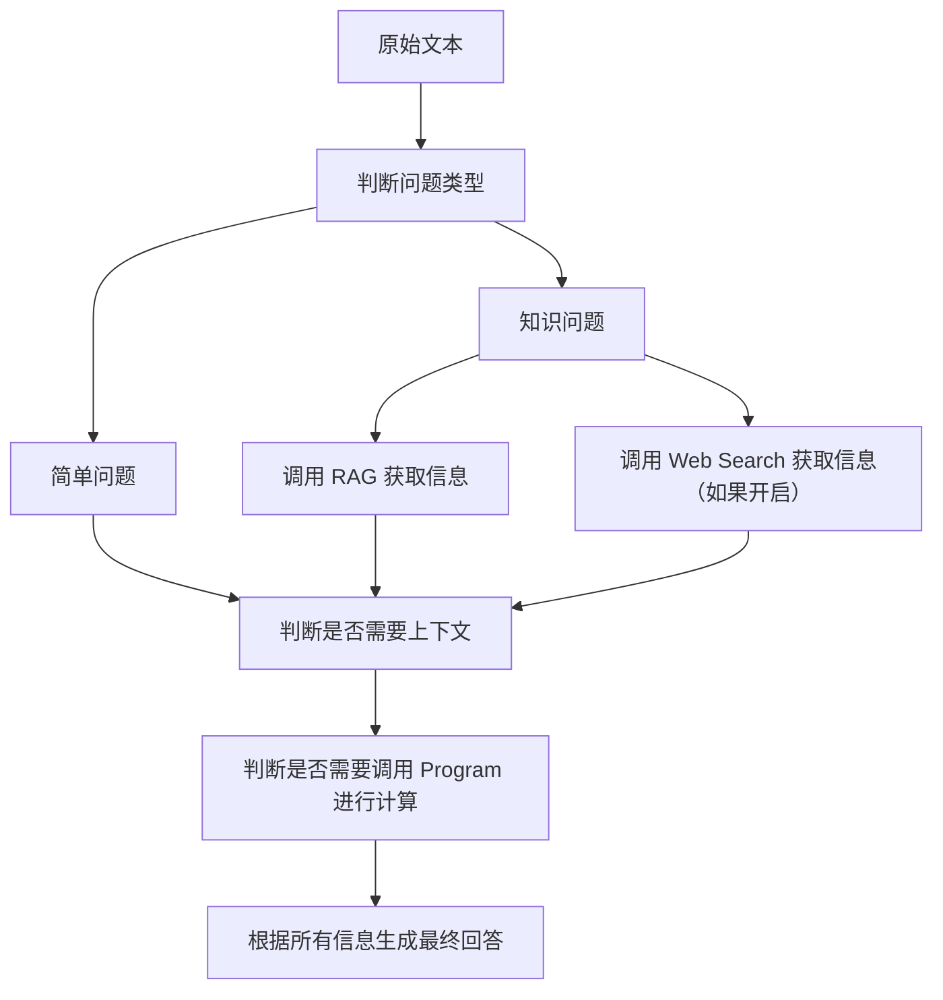
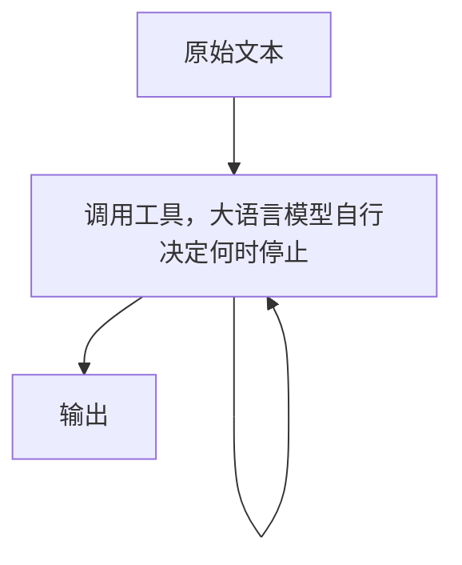

# Application 2 - 高级框架

> 预计耗时：60 天

## 学习目的

目前，AI 在后端的使用除了作业 1 中的应用之外，更多的是搭建一个 AI 服务。

例如“小红书”，你可以在设置界面询问 AI 某些设置如何操作，它会给出较为清晰的回答。

又或者“星野”这种专注于角色扮演的 APP，通过先微调通用对话模型，然后预设 Prompt 来进行和角色对话。

你是否想过拥有一个属于自己的模型？你是否也想过，我们应该从零开始训练，还是在现有模型基础上继续训练。

这一切都可以基于前人搭建的一系列工具，其中较为知名的是 Hugging Face 的 Transformers 库。

它集成在主流的深度学习框架之上，让用户无需关心其底层实现到底是 PyTorch 还是 TensorFlow。

所以在本轮作业，你将基于 Hugging Face 的一些方法，微调一个属于自己的模型。

同时，你也要基于集成 AI 框架，实现一个至少包含上下文管理、RAG、Web Search 和 Program 四个功能模块的虚拟伴侣原型机。

## 学习内容

- Pipeline
- LangChain & Dify
- RAG
- Web Search
- Program
- 微调

## 作业

### 文档 1 - 现代 LLM

在现代的框架下，调用大语言模型只需要挑很少量的参数，例如 Temperature、Top-K、Top-P 等等，而不需要关心模型的底层实现细节。

Hugging Face 是一个友好的开源社区，在上面你可以找到绝大多数的开源模型及其参数。

尽管我们做的是上层应用，但仍应理解现代 LLM 应用是如何基于 Pipeline 这一概念构建的。

阅读 Hugging Face 官方文档教学，了解现代的 LLM 架构（例如 Pipeline），了解 Transformer 的基本原理，了解微调的基本方法，了解 Hugging Face Hub 的使用方法。

在完成上述任务后，你应该写一份文档来阐述你的理解。

### 作业 1 - 复现 MiniMind

微调有两种主流方式。

第一种是直接修改大语言模型本身的参数，另一种是基于 LoRA 的低秩适配。

你应该知道大语言模型由大量高维参数矩阵组成：前者直接更新原始参数，后者可以用一个简化公式表示为：

$$ W' = W + \Delta W,\quad \Delta W = BA $$

其中 $ W $ 是原始权重矩阵，$ A $ 和 $ B $ 是低秩矩阵，$ \Delta W $ 是低秩增量，$ W' $ 是微调后的权重。

$ \Delta W $ 的参数量通常远小于 $ W $，因此微调的计算资源和数据需求可以大幅降低。

在实际实现中，低秩增量通常会作用在多个层上，例如每层对应一组 $ A_i, B_i $，这样可以更细粒度地控制微调过程。

举一个简单的例子，假设我们现在要获得一个具备医疗知识的中文模型，但是你的初始模型 $ A $ 是纯由英文资料训练来的。

所以我们首先要进行第一次微调 $ P_1 $，让模型可以理解中文，得到第一级模型 $ P_1A $，然后进行第二次医疗训练，得到第二级模型 $ P_2P_1A $。

该过程具有“可插拔”特性，所以你在分享模型时，通常只需要分享 LoRA 适配器参数，而原始底座模型可以让对方自行获取。

并且整个过程不需要你花费大量的计算资源去从头训练一个模型。

你在本次作业的任务是复刻一个经典的微调任务：

[MiniMind](https://github.com/jingyaogong/minimind)

在完成作业 1 后，你已经可以去应聘大模型微调的岗位。

### 作业 2 - 虚拟伴侣

在本作业中，你将实现一个虚拟伴侣原型机。

原型机的最终效果是基于某个背景，让模型扮演一个特定的角色。

如果你暂时没有实现前后端，最终效果可以如下：

```bash
python Akashi.py
请输入：你是谁？
Akashi：喵！唯一的修理舰就是茗了喵！在楚克基地被毁灭前一直是由茗支援前线，受伤了的话尽管交给茗就对喵！
请输入：摸摸头。
Akashi：…ny…nya? 嗯……zzzZZ
```

当然你也可以不采取游戏背景，可以采取其他场景，例如校园助手。

如果你暂时没有实现前后端，最终效果可以如下：

```bash
python FzuAssistant.py
请输入：你好。
FzuAssistant：你好，我是 Fzu Assistant，请问你有什么福州大学相关的问题吗？
请输入：如何补办学生证？
FzuAssistant：你可以通过以下步骤补办学生证：...
请输入：请介绍达芬奇的生平。
FzuAssistant：这个问题和福州大学无关，请你换个问题吧。
```

虚拟伴侣需要采用 LangChain 或者 Dify 搭建，并且至少集成上下文管理、RAG、Web Search 和 Program 四个功能模块。

在完成上述内容后，你需要对原模型进行微调，让其可以更好地扮演一个特定角色。

如果你有至少一张 3090 的显卡，你可以尝试在本地部署 14B 的模型。

否则请先调用 API 在本机测试，然后使用 3B 的小模型在 Colab 上测试，最后在 OpenDL 等平台上进行部署（应当先采用 CPU 模式，真正跑的时候再使用 GPU）。

#### LangChain / Dify

LangChain 是一个偏重工程编排的框架，可以将各种 LLM（包括 Hugging Face 模型、OpenAI 模型等）与各种工具（例如搜索引擎、数据库、编程环境等）连接起来，构建复杂应用。

Dify 是一个更偏应用搭建的平台，专注于构建基于 LLM 的应用，提供了较为易用的界面和接口来集成功能模块。

你将实现的虚拟伴侣可以基于这两种框架中的任意一种来搭建，如果你已经有后端的基本知识，那么你只需要阅读文档就可以很快上手。

这里提供两个实现方案，你可以自己判断应该使用哪种方案。

这两种方案在特定的情况下有自己的优势。

方案一：



方案二：



这两种方案可能并非最优，你可以思考并设计一个自己的方案。

#### Tools & Function Call

什么是 Function Call？

在了解 Function Call 之前，你应该在上一个任务了解过 AI 工作流。尽管人为地可以规定其分步完成工作，但是大语言模型本身并不具备所有的能力，例如它可能无法直接访问互联网，或者无法执行一些特定的计算任务。

同时，大语言模型本身目前并不具备更新自己参数的能力，也就是说它无法依靠本身去回答一个超出知识库范围的问题，从而导致模型幻觉。

因此我们需要使用 Function Call，它是指模型在生成回答的过程中，可以调用一些预定义的函数来完成特定的任务，例如查询数据库、调用 Web Search API、执行代码等。

同时，在和模型的对话中，有时模型无法一次性解决所有问题，所以我们需要上下文。

- 上下文管理

上下文管理是指在与用户的交互过程中，模型能够记住之前的对话内容，并根据这些内容来生成更相关和连贯的回答。

实现方式可以是每次调用的时候，让 AI 自行总结上下文并且作为本轮的“知识”输入给模型，或者专门开辟一片区域，每次模型回答的时候，都可以把它认为重要的东西放在这片特定的区域。

当然你也可以将二者结合。

你可以借助 LangChain / Dify 的相关功能将上下文管理集成到你的应用中。

- RAG

由于模型不可以实时获取信息，并且每次重新训练的成本很大，所以你可以专门建立一个新知识库，让模型去检索。

上述思想逐渐演变，从而诞生了 RAG 技术。

RAG 技术十分火爆，它的核心思想是将生成式模型与检索式模型结合起来，利用检索式模型从外部知识库中获取相关信息，然后将这些信息作为上下文输入到生成式模型中，以增强模型的回答能力。

具体而言，将原始文本切分成特定的“块”，将其向量化后，存入对应的向量数据库。

模型回答问题时，将原始文本切分，转为向量，然后在高维空间中和向量空间匹配，得出与之相关的 n 个知识“块”。

然后模型基于这些知识块，再进行问题的回答。

RAG 有很多种形式，最简单的 RAG 将文本切分为固定的块然后检索，在此基础上提出 Top K 的思想，只选取前 k 个知识。

但是这种方法效率很低。

进一步优化，你可以找到 Light RAG，Graph RAG 等等。

这些 RAG 都是基于特定问题提出的特定方案，对于知识固定的小型知识库，采用 Graph RAG 可能有更好的效果，但是对于大型并且需要实时更新的知识库而言，采用其他的 RAG 更好。

- Web Search

Web Search 相关的东西想必不需要过多介绍。

你可以指定特定网页来获取信息，例如对应游戏的 Wiki。

又或者直接发起搜索并读取网页内容，实时获取互联网信息。但需要注意，这种方式存在不确定性，可能检索到错误内容。常见的缓解办法是使用多来源交叉验证，并优先采用权威站点。

- Program

在完成一些任务时，模型可能需要执行一些代码来获取结果，例如计算、数据处理等。

比如你让模型计算 1 - 100 的整数之和。模型可能会先生成一段 Python 代码，运行得到结果后再进行回答。

#### 微调

微调在作业 1 中已经阐明得很清晰，这里不再展开。

#### Bonus - 前后端

你可以使用 FastAPI 或 Flask 来搭建一个简单的 Web 服务接口，使得用户可以通过 HTTP 请求与虚拟伴侣进行交互。

你可以使用 Gradio 或 Streamlit 构建一个简单的用户界面，让用户更方便地与虚拟伴侣交互。

关于前后端，可以见 [Backend](../backend/backend-routine.md) 和 [Frontend](../frontend/frontend-routine.md) 两个文档。

## 推荐教程与参考资料

### Hugging Face 相关教程

1. [Hugging Face Transformers 官方文档](https://huggingface.co/docs/transformers/index)
2. [Hugging Face Course (推荐从 NLP 模块开始)](https://huggingface.co/course/chapter1/1)

### LangChain 相关教程

1. [LangChain Python Docs](https://python.langchain.com/docs/get_started/introduction)
2. [LangChain Expressions Language (LCEL) 教程](https://python.langchain.com/docs/expression_language/)
